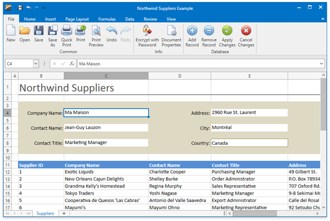

<!-- default badges list -->

<!-- default badges end -->

# WPF Spreadsheet - How to Bind a Spreadsheet to an MS SQL Server Database

This example demonstrates how to bind a cell range on a worksheet to the sample <strong>Northwind</strong> database to load data from the <strong>Suppliers</strong> data table.

## Implementation Details

To accomplish this task, call the [WorksheetDataBindingCollection.BindToDataSource](https://docs.devexpress.com/OfficeFileAPI/devexpress.spreadsheet.worksheetdatabindingcollection.bindtodatasource.overloads) method.

This application also enables users to add, modify or remove data in a data table. They can use the corresponding buttons on the **File** tab, in the **Database** group to edit the data and save their changes back to the database.

To insert new rows, a data entry form is used. The user should fill out given data entry fields and click the **Save** cell to add a new record to the **Suppliers** data table. Clicking the **Apply Changes** button posts the updated data back to the database. To remove a record, the user should select the required Suppliers row on the worksheet and click the **Remove Record** button. The **Delete** dialog will be invoked asking the user to confirm the delete operation.

To send the modified data to the connected database, the **Update** method of the **SuppliersTableAdapter** is used.

## Files to Review

* [MainWindow.xaml](./CS/WpfSpreadsheet_BindToDataSource/MainWindow.xaml) (VB: [MainWindow.xaml](./VB/WpfSpreadsheet_BindToDataSource/MainWindow.xaml))
* [MainWindow.xaml.cs](./CS/WpfSpreadsheet_BindToDataSource/MainWindow.xaml.cs) (VB: [MainWindow.xaml.vb](./VB/WpfSpreadsheet_BindToDataSource/MainWindow.xaml.vb))

## Documentation

* [Data Binding](https://docs.devexpress.com/WPF/117685/controls-and-libraries/spreadsheet/data-binding)
